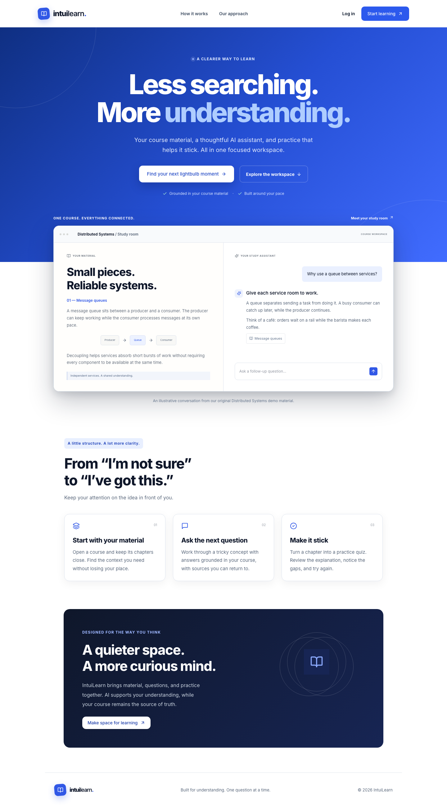
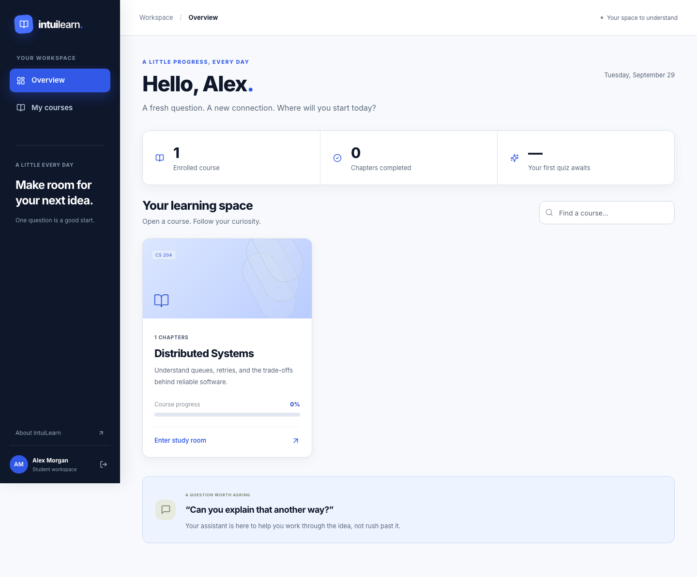
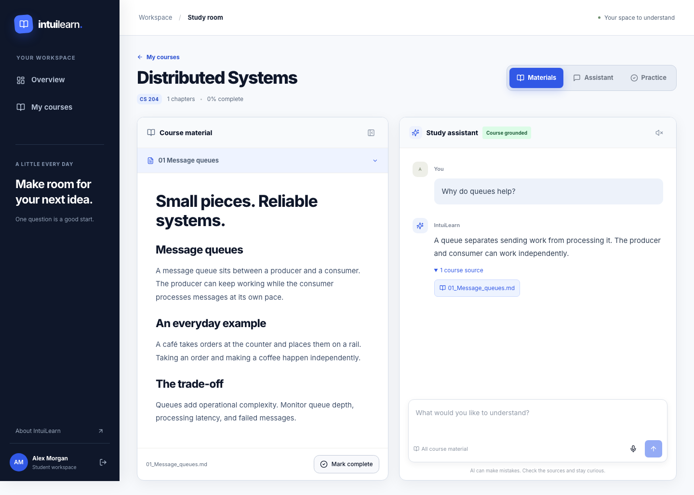
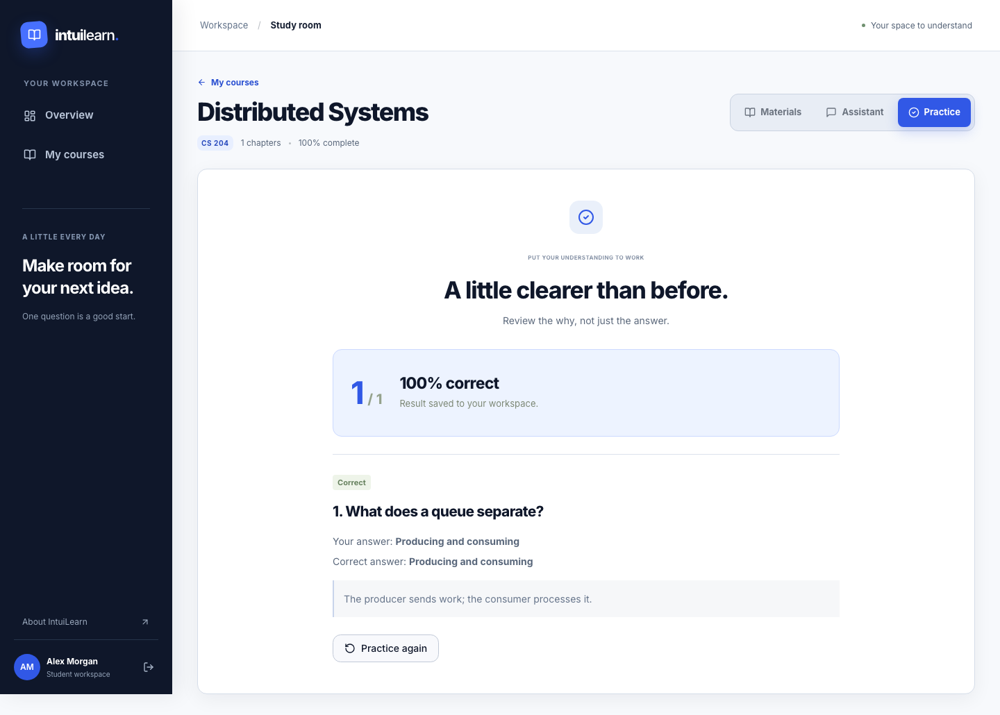
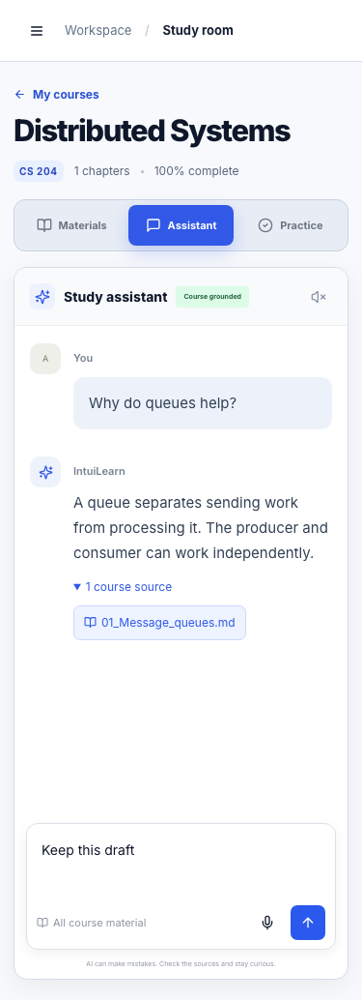
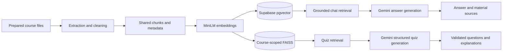

# IntuiLearn

**A grounded AI study workspace for understanding course material, asking better questions, and practicing what you learn.**

IntuiLearn keeps reading, sourced explanations, progress, and generated quizzes in one focused workspace. The included Distributed Systems course and original learning material make the complete flow reproducible from ingestion to quiz review.



## Why IntuiLearn

Studying from scattered files often means switching between a document reader, a general-purpose chatbot, and a separate quiz tool. IntuiLearn connects those activities around the course itself:

- Read prepared course material without leaving the workspace.
- Ask questions answered from enrolled-course content and return to the cited source.
- Generate focused practice with explanations grounded in the same processed material.
- Save chapter completion, conversations, quiz results, and recent activity.
- Keep every student’s data isolated through Supabase Auth, bearer-token verification, enrollment checks, and Row Level Security.

## Product walkthrough

The main study flow is:

1. Create an account and confirm the email address.
2. Complete the academic profile and select a course.
3. Open a chapter and track completion.
4. Ask the assistant a question and inspect its course source.
5. Generate a quiz, answer it, review the explanation, and save the result.

| Dashboard | Grounded study workspace |
| --- | --- |
|  |  |

| Quiz review | Mobile workspace |
| --- | --- |
|  |  |

## Architecture

One ingestion pipeline extracts, cleans, rephrases, and chunks course material before producing normalized 384-dimensional MiniLM embeddings. The final chunks and metadata feed both retrieval paths so chat and practice share the same source of truth.



The React client restores the Supabase session and reads student-owned records under RLS. The Flask API independently verifies the bearer token and enrollment before resolving materials or running retrieval. Material endpoints use opaque manifest IDs and never accept browser-supplied filesystem paths.

See [the detailed architecture](docs/ARCHITECTURE.md) and [implementation report](docs/FINAL_REPORT.md).

## Technology

| Area | Tools |
| --- | --- |
| Frontend | React 18, TypeScript, Vite, Tailwind CSS, TanStack Query, Radix UI |
| Authentication and data | Supabase Auth, PostgreSQL, Row Level Security, pgvector |
| API | Python 3.11, Flask, HTTPX |
| AI and retrieval | Gemini, Sentence Transformers, MiniLM, FAISS |
| Quality | Vitest, Pytest, Playwright, ESLint, TypeScript |

## Run locally

### Prerequisites

- Node.js 20 or newer
- Python 3.11
- A fresh Supabase project
- A Gemini API key for provider-backed generation

Install dependencies and create the ignored local environment files:

```bash
./intuilearn setup
./intuilearn configure
```

Apply the schema and seed from the setup guide, then build both retrieval indexes and start the application:

```bash
./intuilearn ingest
./intuilearn doctor
./intuilearn start
```

Open [http://127.0.0.1:8085](http://127.0.0.1:8085). One `Ctrl+C` stops the frontend and API processes.

For a fresh hosted Supabase project and Gemini-backed generation, follow [the complete setup guide](docs/SETUP.md). It covers schema application, environment configuration, ingestion, health checks, and startup without exposing privileged credentials to the browser.

To exercise the complete interface without external credentials, run `./intuilearn e2e`. The deterministic browser suite starts and stops its own frontend server and intercepts service calls.

## Verification

Run the complete frontend checks:

```bash
cd educrafters-guide
npm ci
npm run typecheck
npm run lint
npm test
npm run build
npm run test:e2e
```

Run the backend checks:

```bash
cd backend
.venv/bin/python -m pytest -q
.venv/bin/python -m pip check
```

The verified suite covers backend authentication and contracts, ingestion and retrieval, quiz validation, frontend grading logic, and 12 browser scenarios across signup, onboarding, session restoration, logout, sourced chat, quiz persistence, failure recovery, keyboard access, reduced motion, and 375px, 768px, and 1440px layouts.

## Security and configuration

Copy the checked-in `.env.example` files to ignored local environment files. The backend owns the Supabase service-role and Gemini credentials; the browser receives only the Supabase URL, anonymous key, and API URLs.

Never place `SUPABASE_SERVICE_ROLE_KEY` or `GEMINI_API_KEY` in a `VITE_` variable. The API derives identity from the verified session and never trusts a caller-supplied user ID.

## Current limitations

- Prepared course material is ingested through the CLI; browser uploads are not implemented.
- Scanned PDFs require OCR before ingestion.
- Source references identify the material and chapter, but do not claim page-level precision.
- Local demo mode replaces Gemini generation with deterministic grounded responses; configure a valid Gemini key for provider-backed generation.
- Deployment and migration of accounts from a legacy Supabase project are outside the current release.

## Project documentation

- [Test the complete system yourself](docs/TEST_IT_YOURSELF.md)
- [Exact setup instructions](docs/SETUP.md)
- [Repeatable live demo script](docs/DEMO.md)
- [Architecture and retrieval paths](docs/ARCHITECTURE.md)
- [Implementation details](docs/IMPLEMENTATION.md)
- [Completion report](docs/FINAL_REPORT.md)

---

Built as a full-stack capstone focused on grounded AI interaction, authorization boundaries, reproducible ingestion, and a clear study experience.
