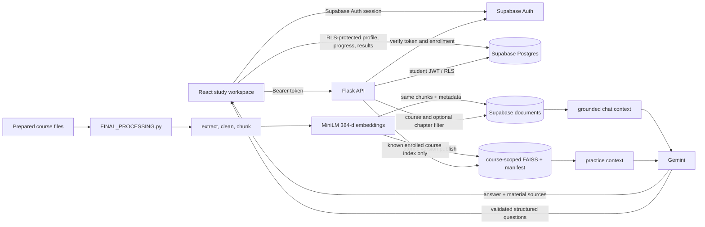

# Architecture

The browser uses the Supabase publishable/anon key and the signed-in user's access token. It never receives the service-role key or Gemini key. The Flask API performs identity lookup from the token; API bodies contain course names and study input, not trusted user IDs.

Chat calls the `match_documents` RPC. The RPC filters by enrolled course and optional chapter before ranking normalized MiniLM embeddings with cosine similarity. When no chunk reaches the configured threshold, the API returns a grounded insufficient-context response without calling Gemini.

Quiz generation resolves the database course to a numeric ID, then loads only that course's server-side manifest and FAISS index. Generated question structures are rejected unless option counts, answer types, answer indices, and fill-in answers match the requested quiz type.

Ingestion reads prepared PDF, DOCX, PPTX, TXT, and Markdown files. It rejects empty files and scanned PDFs without readable text. Both retrieval paths receive the same final chunks and metadata. A local version becomes current only after all files are written; Supabase document replacement is handled by one database function call.
